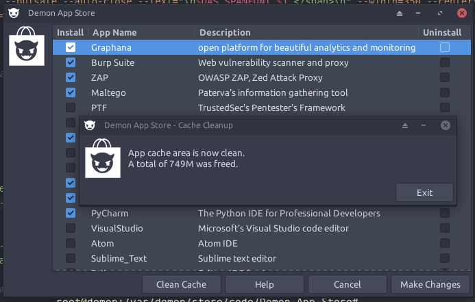

Finally, the Demon App Store is here! This, technically, should work with any Debian 10 distribution, but was designed for [Demon Linux](https://demonlinux.com)
## The Store UI
The store UI is very simple to use. If you want an application installed, simply make sure that it is checked under the "Install" column. If you would like to uninstall an application, just maked sure that it is checked under the "uninstall" column. Then, hit the "Make Changes" button.


## Self Maintaining
The Demon App Store will update itself in /appdev/ before each run. This is due to the ```demon-app-store-workflow.sh``` file which is stored in ```/usr/local/sbin/``` which holds all of the working code.

## Caching
All installation fies will be cached and checked-in `/var/demon/store/app-cache`. To clean up the cache area, simply hit the "Clean Cache" button in the UI.



## Integrity
All application files are checked for integrity before re-downloading using hard-coded md5 hashes,
```
[+] $app: Graphana
[+] Checking if Graphana is already installed ...
[+] Cached file found: /var/demon/store/app-cache/grafana_6.3.3_amd64.deb
[+] Checksum verified, [ OK ]
```
This makes the Demon App Store more efficient by saving bandwidth of the user and the author/host of the application and dependency files.

## Install 
To install simply clone this repository and copy the `demon-app-store.sh` file to `/usr/local/sbin`.
Then, run it with `demon-app-store.sh` and it will get the lateste version of itself, and place it into `/var/demon/store/code`.

### Dependencies
* wget
* awk, sed, grep
* apt
* git
* yad
* tail
* dpkg
* curl
* add-apt-repository
